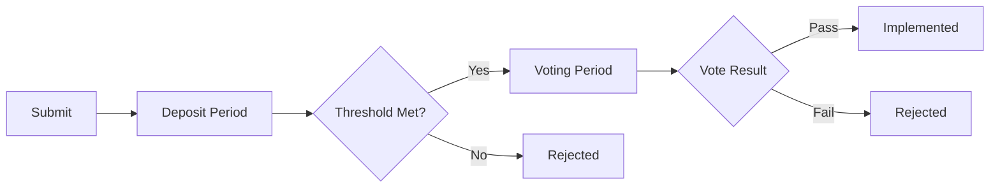

# Governance Guide

Participate in PAW's decentralized governance and shape the future of the network.

## Overview

PAW uses on-chain governance where token holders can:
- Submit proposals
- Vote on changes
- Update parameters
- Allocate community funds
- Upgrade the network

## Governance Process

### 1. Proposal Submission

Anyone with minimum deposit can submit proposals.

**Proposal Types:**
- **Text Proposals**: General decisions
- **Parameter Changes**: Modify network parameters
- **Software Upgrades**: Protocol updates
- **Community Spend**: Treasury allocation

### 2. Deposit Period (7 days)

- Minimum deposit: 1,000 PAW
- Others can add deposits
- Reach threshold to enter voting
- Deposits returned if proposal passes

### 3. Voting Period (14 days)

- All stakers can vote
- Vote weight = staked amount
- Can change vote before period ends
- Inherited from validator if you don't vote

### 4. Tally

Proposal passes if:
- Quorum reached (>40% of staked tokens vote)
- Threshold met (>50% vote Yes)
- Veto threshold not exceeded (<33.4% vote NoWithVeto)

## How to Vote

### Using Desktop Wallet

1. Open Governance tab
2. Browse active proposals
3. Read proposal details
4. Click "Vote"
5. Select option (Yes/No/Abstain/NoWithVeto)
6. Confirm transaction

### Using CLI

```bash
# List active proposals
pawd query gov proposals --status voting_period

# View proposal details
pawd query gov proposal 1

# Vote on proposal
pawd tx gov vote 1 yes \
  --from my-wallet \
  --fees 500upaw

# Vote options: yes, no, abstain, no_with_veto
```

## Vote Options

| Option | Meaning | Use When |
|--------|---------|----------|
| **Yes** | Support the proposal | You agree with changes |
| **No** | Oppose the proposal | You disagree but it's valid |
| **Abstain** | Contribute to quorum only | No strong opinion |
| **NoWithVeto** | Strongly oppose | Proposal is spam/malicious |

::: tip NoWithVeto
If >33.4% vote NoWithVeto, deposits are burned. Use only for harmful proposals.
:::

## Submitting Proposals

### Text Proposal

```bash
# Create proposal JSON
cat > proposal.json << EOF
{
  "title": "Increase Block Size",
  "description": "Proposal to increase max block size from 200KB to 300KB",
  "type": "Text",
  "deposit": "1000000000upaw"
}
EOF

# Submit proposal
pawd tx gov submit-proposal \
  --proposal proposal.json \
  --from my-wallet \
  --fees 500upaw
```

### Parameter Change

```bash
# Change staking parameter
pawd tx gov submit-proposal param-change \
  --title "Reduce Unbonding Time" \
  --description "Reduce unbonding period from 21 to 14 days" \
  --param staking.UnbondingTime=14d \
  --deposit 1000000000upaw \
  --from my-wallet
```

### Software Upgrade

```bash
# Propose network upgrade
pawd tx gov submit-proposal software-upgrade v2.0 \
  --title "Upgrade to v2.0" \
  --description "Upgrade with new features" \
  --upgrade-height 1000000 \
  --upgrade-info '{"binaries":{"linux":"https://..."}}' \
  --deposit 1000000000upaw \
  --from my-wallet
```

### Community Spend

```bash
# Propose community spending
pawd tx gov submit-proposal community-pool-spend \
  --title "Fund Development Team" \
  --description "Allocate 100,000 PAW for Q1 development" \
  --recipient paw1xxxxx... \
  --amount 100000000000upaw \
  --deposit 1000000000upaw \
  --from my-wallet
```

## Adding Deposits

```bash
# Add deposit to proposal
pawd tx gov deposit 1 500000000upaw \
  --from my-wallet \
  --fees 500upaw

# Check deposit status
pawd query gov deposits 1
```

## Governance Parameters

### Current Parameters

```bash
# Deposit parameters
pawd query gov params deposit

# Voting parameters
pawd query gov params voting

# Tally parameters
pawd query gov params tallying
```

### Default Values

| Parameter | Value |
|-----------|-------|
| Min Deposit | 1,000 PAW |
| Deposit Period | 7 days |
| Voting Period | 14 days |
| Quorum | 40% |
| Threshold | 50% |
| Veto Threshold | 33.4% |

## Best Practices

### For Voters

1. **Read Proposals Carefully**
   - Understand implications
   - Check technical details
   - Review discussions

2. **Vote Your Stake**
   - Don't rely only on validator votes
   - Express your opinion

3. **Participate in Discussions**
   - Discord governance channel
   - Commonwealth forum
   -  discussions

4. **Monitor Results**
   - Track voting progress
   - Watch for malicious proposals

### For Proposers

1. **Build Consensus First**
   - Discuss in community forums
   - Gather feedback
   - Refine proposal

2. **Write Clear Proposals**
   - Specific title
   - Detailed description
   - Implementation plan
   - Expected outcomes

3. **Set Realistic Timelines**
   - Consider development time
   - Allow for testing
   - Plan migration path

4. **Engage with Community**
   - Answer questions
   - Address concerns
   - Update stakeholders

## Common Governance Scenarios

### Changing Network Parameters

```bash
# Example: Reduce minimum commission
pawd tx gov submit-proposal param-change \
  --title "Lower Minimum Commission" \
  --description "Reduce from 5% to 3%" \
  --param staking.MinCommissionRate=0.03 \
  --deposit 1000000000upaw
```

### Emergency Response

```bash
# Pause a module in emergency
pawd tx gov submit-proposal param-change \
  --title "Emergency DEX Pause" \
  --description "Pause DEX due to exploit" \
  --param dex.Paused=true \
  --deposit 1000000000upaw

# Expedited voting (2 days instead of 14)
--expedited
```

### Treasury Management

```bash
# Check community pool balance
pawd query distribution community-pool

# Propose spending
pawd tx gov submit-proposal community-pool-spend \
  --title "Marketing Campaign" \
  --amount 50000000000upaw \
  --recipient paw1xxxxx...
```

## Guardian DAO

The Guardian DAO provides oversight:

- **Emergency Powers**: Can pause modules in crisis
- **Veto Rights**: Can block malicious proposals
- **Parameter Bounds**: Enforce reasonable changes
- **Security Review**: Audit critical proposals

### Guardian Composition

- 7 elected members
- 2-year terms
- 4/7 multisig required
- Regular elections

## Proposal Lifecycle



## Monitoring Governance

### Track Proposals

```bash
# Active proposals
pawd query gov proposals --status voting_period

# Passed proposals
pawd query gov proposals --status passed

# Your votes
pawd query gov votes-by-voter paw1xxxxx...
```

### Governance Dashboard

Visit [gov.paw.network](https://gov.paw.network) for:
- Active proposals
- Voting progress
- Historical results
- Discussion forums
- Analytics

## Video Tutorial

<div class="video-container">
  <iframe
    src="https://www.youtube.com/embed/GOVERNANCE_VIDEO_ID"
    frameborder="0"
    allow="accelerometer; autoplay; clipboard-write; encrypted-media; gyroscope; picture-in-picture"
    allowfullscreen>
  </iframe>
</div>

---

**Previous:** [Staking](/guide/staking) | **Next:** [Developer Quick Start](/developer/quick-start) →
