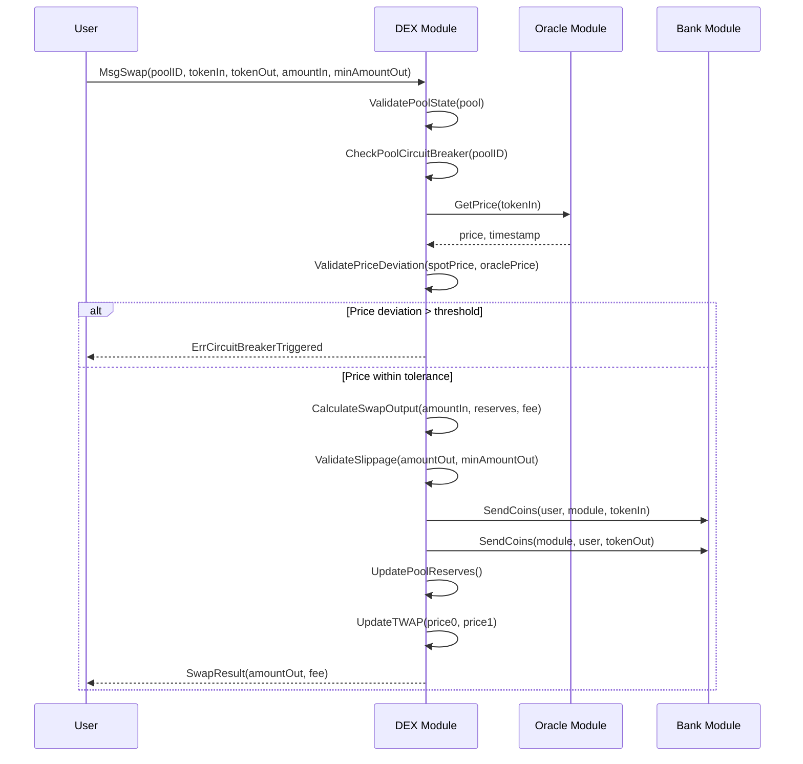
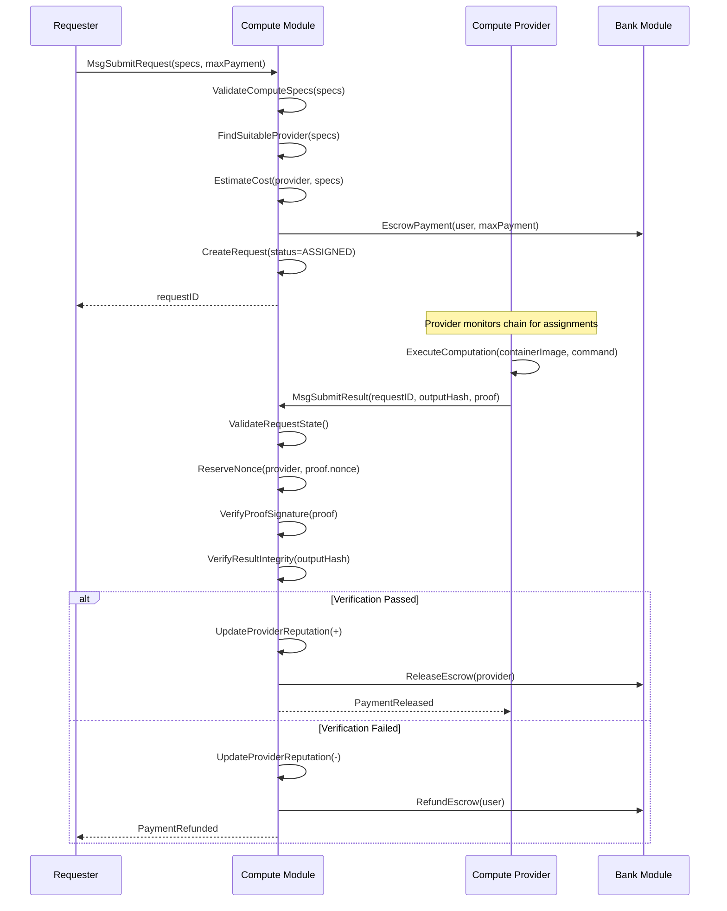
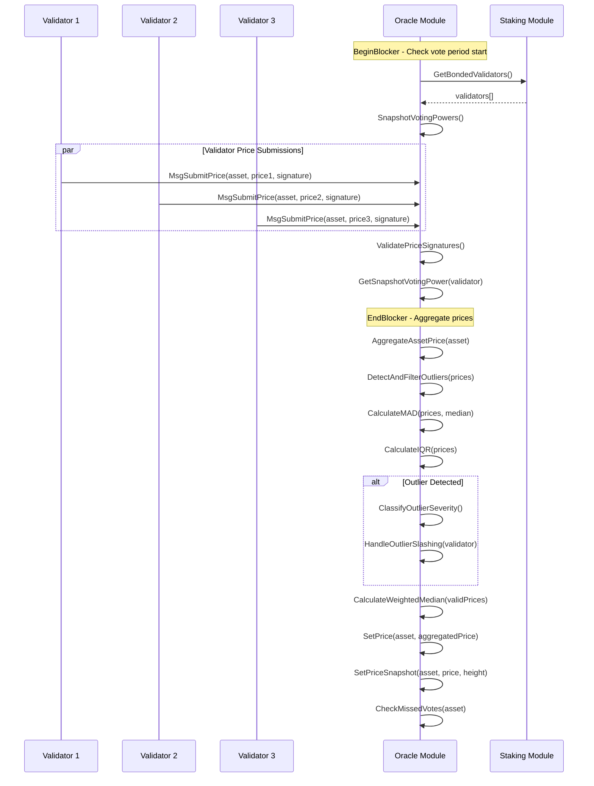
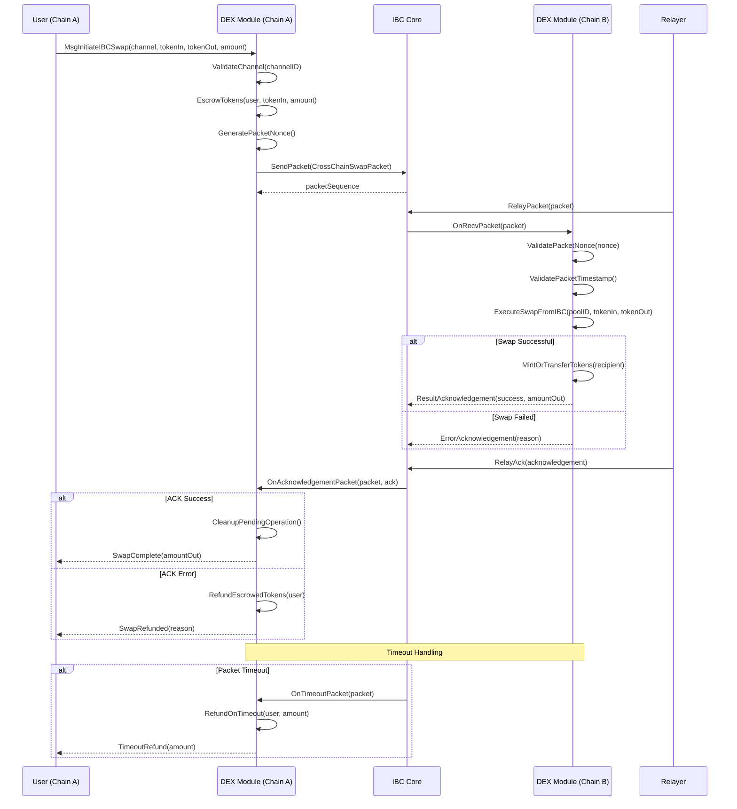

# Module Interaction Diagrams

This document provides sequence diagrams for the primary cross-module flows in PAW blockchain.

## 1. DEX-Oracle Price Flow

Shows how the DEX module queries the Oracle for pricing during swap execution.

## 2. Compute Job Flow

Shows the lifecycle of an off-chain compute request from submission to payment.

## 3. Oracle Aggregation Flow

Shows how validators submit prices and the consensus mechanism aggregates them.

## 4. IBC Cross-Chain Swap Flow

Shows how cross-chain swaps are handled via IBC packet transmission.

## Module Dependency Summary

| Source Module | Target Module | Interaction Type |
|---------------|---------------|------------------|
| DEX | Oracle | Price queries for circuit breaker |
| DEX | Bank | Token transfers, escrow |
| Oracle | Staking | Validator voting power |
| Compute | Bank | Payment escrow/release |
| All | IBC Core | Cross-chain packet handling |

## Event Flow

All modules emit events for indexing and monitoring:

- **DEX**: `dex_swap`, `dex_pool_created`, `dex_liquidity_added`
- **Oracle**: `oracle_price_aggregated`, `oracle_outlier`, `oracle_fallback`
- **Compute**: `request_submitted`, `result_submitted`, `request_completed`
- **IBC**: `ibc_packet_receive`, `ibc_packet_ack`, `ibc_packet_timeout`
